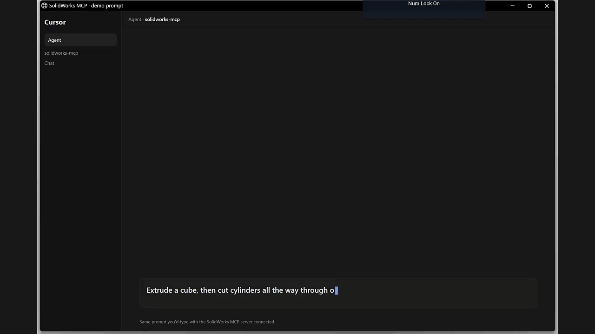

# SolidWorks MCP

[](LICENSE)
[](#)
[](https://nodejs.org/)
[](https://www.typescriptlang.org/)
[](https://dotnet.microsoft.com/)
[](https://modelcontextprotocol.io/)
[](#)

MCP server that drives SolidWorks on Windows from Cursor (or another MCP client). Open and edit parts and assemblies, create geometry, mates, measure, rebuild, export, and more — without writing macros.

> [!NOTE]
> **Heavy WIP.** This project is under active development. APIs, tools, and behavior will change. Expect rough edges, missing coverage, and breaking updates.

> **Needs:** Windows · licensed SolidWorks · [Cursor](https://cursor.com) (or another MCP client) · Node.js 20+ · .NET 8 SDK  
> SolidWorks should be open (or launchable) on the same machine.

## Workflow

1. Have SolidWorks running (open a document, or start from a blank session).
2. In Cursor, ask for the change you want — edit what’s open, or build a new part from scratch.
3. The assistant drives SolidWorks through this server.
4. Check the model, then confirm before it saves.

Examples:

- "List the mates on this assembly and tell me which ones are failing."
- "Measure the distance between these two faces."
- "Add a coincident mate between the flange face and the bracket face."
- "Export a PNG of the current view so I can check the pose."
- "Extrude a cube, then cut cylinders all the way through on each face."
- "Save a checkpoint before we change anything."

Destructive tools require `confirm: true`. Don't save until you've said the model looks right.

## Setup

On the Windows machine that runs SolidWorks:

### 1. Install Node and .NET

[Node.js 20+](https://nodejs.org/) and the [.NET 8 SDK](https://dotnet.microsoft.com/download).

### 2. Clone and build

```powershell
git clone https://github.com/jaylamping/solidworks-mcp.git
cd solidworks-mcp
npm install
npm run build
```

### 3. Check SolidWorks

Start SolidWorks, then:

```powershell
npm run worker:status
```

You should see a live COM connection (and the open document if any).

### 4. Connect Cursor

Point MCP at your clone (path placeholders → your real folder):

```json
{
  "mcpServers": {
    "solidworks": {
      "command": "node",
      "args": [
        "C:/path/to/solidworks-mcp/node_modules/tsx/dist/cli.mjs",
        "C:/path/to/solidworks-mcp/src/index.ts"
      ],
      "env": {
        "SOLIDWORKS_MCP_TOOL_TIER": "extended",
        "SOLIDWORKS_MCP_ALLOWED_ROOTS": "C:/cad;D:/projects;C:/path/to/solidworks-mcp/.demo",
        "SOLIDWORKS_MCP_PERSISTENT_WORKER": "1"
      }
    }
  }
}
```

| Variable | Meaning |
|----------|---------|
| `SOLIDWORKS_MCP_ALLOWED_ROOTS` | Semicolon-separated folders allowed for open/save/export. Already-open docs are trusted for `path` even outside these roots; new opens and output paths still require a listed root. UNC/`\\wsl$` roots are supported. |
| `SOLIDWORKS_MCP_TOOL_TIER` | `core` / `extended` / `advanced` / `debug` / `all`. `extended` is a good default. |
| `SOLIDWORKS_MCP_PERSISTENT_WORKER` | `1` keeps a warm worker (faster). |

Reload MCP after saving. Call SolidWorks tools one at a time — COM is single-threaded.

## Try the demo

With SolidWorks open and MCP connected, ask:

> Extrude a cube, then cut cylinders all the way through on each face.

[](https://github.com/jaylamping/solidworks-mcp/blob/main/docs/assets/demo-build-part.mp4)

Or from the repo: `npm run demo:build-part`.

## Tools

100+ tools across documents, assemblies, mates, modeling, measure/inspect, selection, URDF helpers, and low-level API invoke. Search with `solidworks_search_tools`, or see [`docs/api/`](docs/api/).

## Safety

- Mutating tools often auto-checkpoint under `.checkpoints/` next to the document.
- Confirm the model (or a PNG) before a hard save.
- Assembly lock-in uses `confirm_and_save` (rebuild → mate health → save → reopen → pose check).
- Paths outside `SOLIDWORKS_MCP_ALLOWED_ROOTS` are rejected.

See [Troubleshooting](docs/troubleshooting.md).

---

## For developers

```text
Cursor (or other MCP client)
  → Node (TypeScript MCP server)
  → SolidWorksComWorker (.NET 8, STA)
  → SolidWorks COM
```

Tool metadata: `src/tool-spec/catalog.ts`. Refresh with `npm run generate:tools` — don't hand-edit generated allowlists. Persistent worker: `SOLIDWORKS_MCP_PERSISTENT_WORKER=1` or `SOLIDWORKS_MCP_WORKER_MODE=session`.

| Variable | Purpose |
|----------|---------|
| `SOLIDWORKS_MCP_ALLOWED_ROOTS` | Allowed open/save/export roots |
| `SOLIDWORKS_MCP_TOOL_TIER` | `core` / `extended` / `advanced` / `debug` / `all` |
| `SOLIDWORKS_MCP_INVOKE_WRITE` | Allow writes via `solidworks_invoke` |
| `SOLIDWORKS_MCP_PERSISTENT_WORKER` | `1` for warm session worker |
| `SOLIDWORKS_MCP_WORKER_MODE` | `session` or omit for ephemeral |
| `SOLIDWORKS_MCP_AUTO_CHECKPOINT` | `0` disables auto checkpoints |
| `SOLIDWORKS_MCP_CHECKPOINT_DEBOUNCE_SEC` | Checkpoint reuse window (default `45`) |

```powershell
npm run typecheck
npm run build
npm run generate:tools -- --check
npm run check:safety
npm run check:schemas
npm run validate:tools
npm run demo:build-part
```

`demo:record-video` regenerates `docs/assets/` (needs SolidWorks + Edge + `ffmpeg`).

- [Troubleshooting](docs/troubleshooting.md)
- [Error catalog](docs/errors/README.md)
- [CAD automation notes](docs/cad-automation.md)
- [COM invoke ABI](docs/com-invoke-abi.md)
- [API reference corpus](docs/api-reference/README.md)

## License

MIT — see [LICENSE](LICENSE).

SolidWorks® is a trademark of Dassault Systèmes. This project is not affiliated with or endorsed by Dassault Systèmes.
